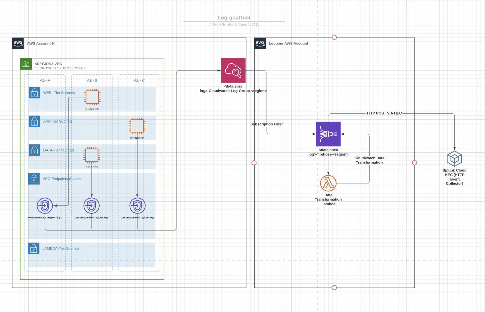

# logQua-duct

This repo serves as the single point of building the vehicle for transporting logs from cloudwatch to splunk via kinesis + lambda.

Reasoning for leveraging this architecture is due to its high scalability, fault tolerance and visibility into transfer of data to splunk.

## How it works

- In your project you have two mandatory files, `cloudwatch_destinations.tf` and `core_infrastructure.tf`. These files serve as the 2 major components of the architecture. `cloudwatch_destinations.tf` has control over which cloudwatch source your data is originating from, it can build a log group / stream or use an exisiting one. `core_infrastructure.tf` is responsible for stamping out the necessary infrastructure to support the kinesis data firehose, this includes the following:
  - Kinesis Data Firehose (supporting IAM Roles + Policies)
  - S3 Bucket for failed messages over acknowledgment time
  - Lambda Script that supports Data ETL capabilities, multiple versions can be used

## How to Make A new Log-Quaduct

1. Copy the file structure from an existing project. It should contain the core files:

- `cloudwatch_destinations.tf`
  - `core_infrastructure.tf`
  - `locals.tf`
  - `variables.tf`
  
2. Modify your projects locals file according to requirements of your project, example below (req vars are in `<>`):

  ```
################################################################
#
#                   Local Data Sources
#
################################################################

locals {
  tags         = { "service-id" = "${var.service-id}" }
  service_name = "<service-logs>"
  hec_token    = <var.hec_token>
  sender_account_numbers = [<"12345678910">] 
  splunk_hec_endpoint =  "<https://splunk.com>"
}

variable "hec_token" { type = string }
variable "service-id" { type = string }

  ```

  3. Modify the `cloudwatch_destinations.tf` and `core_infrastructure.tf` to your logging pipelines specific requirements.
  4. Commit, push, party.

## General Architecture


